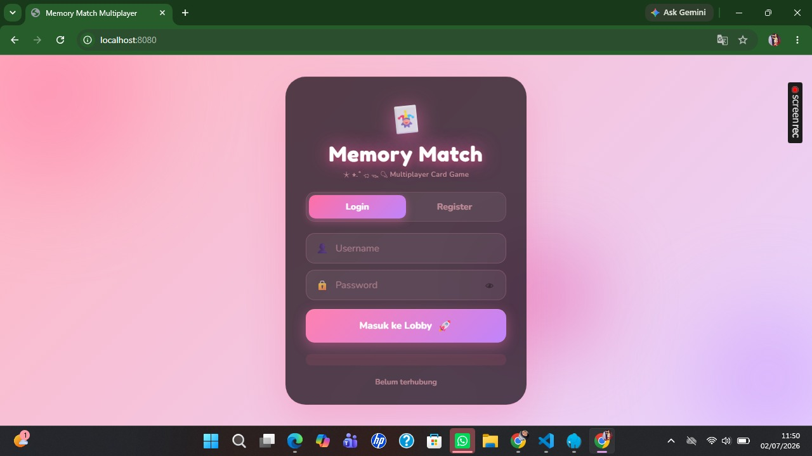
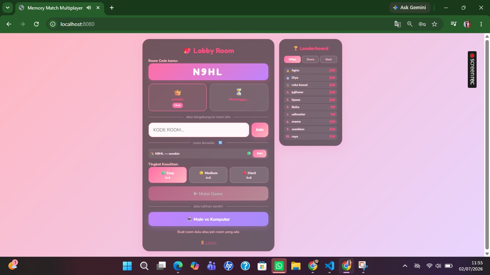
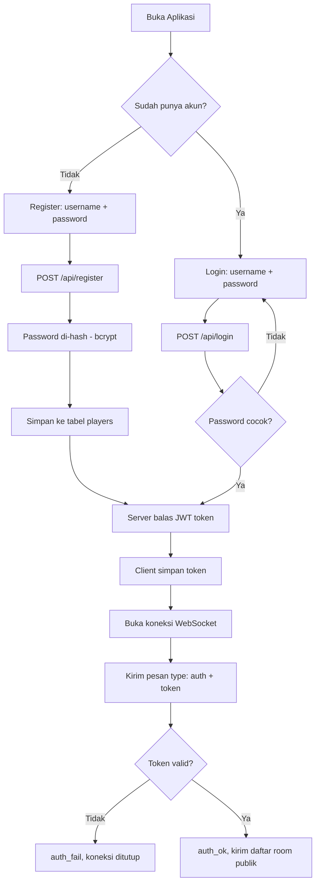
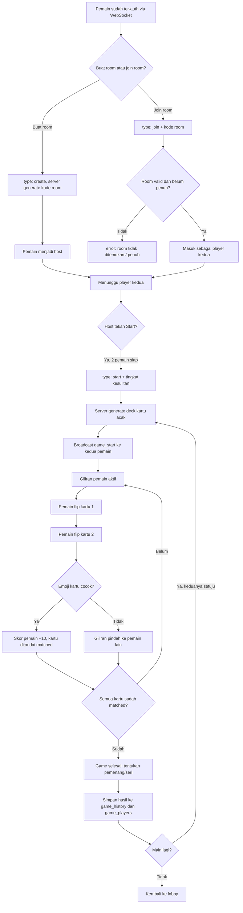

# Memory Match Duel

Game multiplayer *memory card matching* real-time berbasis WebSocket, dikembangkan untuk mata kuliah **Cloud Computing**.

Dua pemain saling berhadapan dalam satu room, bergiliran membuka kartu untuk mencari pasangan yang cocok. Skor, giliran, dan status permainan disinkronkan secara real-time antar pemain melalui koneksi WebSocket, dengan sistem autentikasi, riwayat permainan, dan leaderboard yang tersimpan di database.

---

## Anggota Kelompok

| Nama | NPM | Peran |
|---|---|---|
| Mauliya Rahmi| 2410010267 | Frontend|
| Halimatussa'diah |2410010269| Backend |
| Meisheila Leluni Kuswoyo| 2410010276 | Laporan Akhir |
| Muhammad Khairil Ilham | 2410010205 | Database |
|  Muhammad Ixmal Alimudin | 2410010280 |Statistik |

---

## Link Penting

| Item | Link |
|---|---|
| Video Demo | - |
| Proposal (PDF) | https://drive.google.com/file/d/1bvOkvZ2rAKJQAigj3fRT_gUDFbLzsB5B/view?usp=sharing |
| Laporan Akhir (PDF) | - |
| Slide Presentasi (PDF) | https://drive.google.com/drive/folders/1jXUDbsvewBSGs3SpMtn77xHiy_lf5iH7?usp=sharing |

---

## Teknologi yang Digunakan

**Backend**
- Node.js: runtime server
- Express 5: REST API dan static file serving
- ws: WebSocket server (komunikasi real-time dua arah)
- better-sqlite3: database SQLite (sinkron, ringan)
- bcrypt: hashing password
- jsonwebtoken (JWT): autentikasi dan sesi (token 7 hari)
- dotenv: konfigurasi environment variable

**Frontend**
- HTML5, CSS3
- JavaScript (Vanilla, tanpa framework)
- WebSocket API (native browser)

**Database**
- SQLite (game.db), terdiri dari tabel players, login_history, game_history, game_players

---

## Screenshot Sistem

> Tambahkan minimal 3 screenshot sistem di sini, contoh:

| Login / Register | Lobby dan Room | Gameplay |
|---|---|---|
|  |  |  |

---

## Alur Sistem (Flowchart)

### 1. Alur Autentikasi dan Koneksi



### 2. Alur Permainan (Room dan Gameplay)



---

## Cara Menjalankan Sistem

### Prasyarat
- Node.js versi 18 ke atas (https://nodejs.org/)
- npm (sudah termasuk dalam instalasi Node.js)

### Langkah Instalasi

1. Clone / ekstrak proyek
   ```bash
   cd websocket-memory-match
   ```

2. Install dependencies
   ```bash
   npm install
   ```

3. (Opsional) Konfigurasi environment

   Buat file .env di root folder untuk mengatur secret JWT dan port:
   ```env
   PORT=8080
   JWT_SECRET=ganti-dengan-secret-yang-panjang-dan-acak
   ```

4. Jalankan server
   ```bash
   npm start
   ```
   atau untuk mode pengembangan (auto-restart saat file berubah):
   ```bash
   npm run dev
   ```

5. Buka aplikasi

   Akses melalui browser di:
   ```
   http://localhost:8080
   ```

6. Bermain
   - Daftar akun baru atau login dengan akun yang sudah ada.
   - Buat room baru (dapatkan kode room) atau join room menggunakan kode yang dibagikan teman.
   - Setelah 2 pemain siap, host menekan tombol Start untuk memulai permainan.
   - Bergiliran membuka kartu, cocokkan pasangan, dan raih skor tertinggi.

---

## Struktur Proyek

```
websocket-memory-match/
├── server.js          # Entry point server (Express + WebSocket + REST API)
├── database.js        # Koneksi dan query SQLite (better-sqlite3)
├── game.db             # File database SQLite
├── package.json
└── public/
    ├── index.html      # Halaman utama (login, lobby, game)
    ├── script.js       # Logika client (WebSocket, render UI, audio)
    ├── style.css        # Styling
    ├── card.png          # Aset gambar kartu
    ├── lobby.mp3          # Musik lobby
    └── game.mp3            # Musik permainan
```
